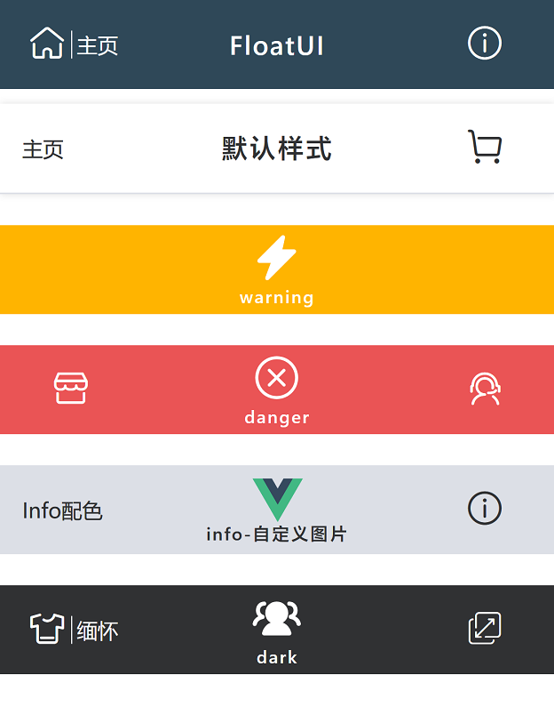

# 基于vue的组件库

##技术栈：
- vue
- vue-cli
- webpack
- less
- vue-router

packages里面存放的是组件库源码。
examples里面是测试页面。


## 初始化项目
```
npm install
```
*建议使用 `cnpm install`*

### 运行
```
npm run serve
```

### 构建
*此处构建的是测试页面，用来查看效果*
```
npm run build
```

**具体请查看：[教程](https://www.notion.so/UI-1bb26f916e974946a9f7e57d6712a1cb)**


## 组件介绍

### 主题

主题主要涉及 配色、边框、阴影等。

- 主题名-颜色：

  内置7类颜色:

  - **dark** 深色 \#303133
  - **primary** 主要 \#2f4858
  - **success** 成功 \#0881a3
  - **warning** 警告 \#ffb400
  - **danger** 危险 \#ea5455
  - **info** 信息 \#DCDFE6
  - **basic** 基础 #FFFFFF

  效果：

  

  颜色加深 - 使用less语法 #color-darken[主题颜色名]  加深度为12%

  边框 - 同上 #border-darken[主题颜色名]  加深度为5%

- 文字和背景容器

  同时给一个元素 定义文字颜和背景颜色。容器类名  `.content-color-主题名` 如 `.content-color-dark`

- 圆角，预定义三种圆角 大小分别为 10px 8px 6px

  - .radius-large
  - .radius-normal
  - .radius-small

- 阴影（分普通和加深）

  - 普通  `.box-shadow-主题名`
  - 加深 `.box-shadow-max-主题名`

### 组件

1. **grid布局**

   grid布局使用f-row 和 f-col来实现行和列。24格栅布局，效果如下：

   

   **f-row:**  *\*\*为必填*

   | props     | tips              | type   | default |
   | --------- | ----------------- | ------ | ------- |
   | className | 自定义类名        | String | ''      |
   | gutter    | 子元素间隔 单位px | Number | 0       |

   **f-col**

   | props     | tips                         | type   | default |
   | --------- | ---------------------------- | ------ | ------- |
   | span      | 元素占比（24分）             | Number | 24      |
   | offset    | 向左偏移量（和span一个单位） | Number | 0       |
   | className | 自定义类名                   | String | ''      |

   

2. **button按钮**

   效果图：

   

   **props:**

   | props   | tips                              | type    | default |
   | ------- | --------------------------------- | ------- | ------- |
   | type    | 按钮样式                          | String  | primary |
   | disable | 是否禁用                          | Boolean | false   |
   | loading | 显示加载                          | Boolean | false   |
   | text    | 按钮文字                          | String  | ''      |
   | size    | 按钮大小（large/middle/small)可选 | String  | large   |
   | icon    | 按钮图标类名（基于font-class)     | String  | ''      |

   *提供了一个匿名slot。如果text 和icon都可以不指定，然后写在slot里面自定义内容。*

   监听click事件：btnclick

   【更新】：去除了按钮圆角。使用者可以在组件调用时，加上全局预设的radius圆角样式className或者自定义。

   

3. **header顶栏**

   三分栏布局。只提供三个props 和 三个具名插槽。中间title占50%，两侧比例为1:1. flex布局。子元素height均为100%。

   

   **props:**

   | props  | tips      | type   | default |
   | ------ | --------- | ------ | ------- |
   | type   | 主题样式  | String | default |
   | title  | title文字 | String |         |
   | height | 高度      | String | 50px    |

   **slot**

   - title  
   - left
   - right

   

4. **TripleHeader  header封装组件 **

   效果：

   

   *阴影和边框样式可以自定义加进去，也可以引用assets/theme/default.less中的主题样式类名。*

   **props**

   | props     | tips                   | type                         | default                |
   | --------- | ---------------------- | ---------------------------- | ---------------------- |
   | type      | 主题样式               | String                       | ''  为空时default      |
   | titleText | 标题文字               | String                       | ''                     |
   | titleIcon | 标题图标。可选图片地址 | Object{type:'icon',value:''} | {type:'icon',value:''} |
   | leftText  | 左侧文字               | String                       | ''                     |
   | leftIcon  | 左侧图标font-class     | String                       | ''                     |
   | rightIcon | 右侧图标 font-class    | String                       | ''                     |

   注意：*titleIcon 默认type是icon,如果是图片，需要传入*

   ```json
   {
   	type:'img',
       value:require(url)
   }
   ```

   *需要require才能被webpack打包。*

   

   **事件：**

   - 标题click   `clicktitle`
   - 左侧click  `clickleft`
   - 右侧click  `clickright`

   

5. **sidebar侧边栏**

   侧边栏是固定在屏幕左侧或右侧，用来呼出的一个二级菜单。效果如图：

   

   **props**

   | props     | tips                 | type    | default |
   | --------- | -------------------- | ------- | ------- |
   | position  | 位置(left/right可选) | String  | left    |
   | type      | 主题样式             | String  | default |
   | className | 自定义类             | String  |         |
   | show      | 是否显示             | Boolean | false   |

   自定义类名如果有的效果不起作用，可以加! `important`

   **滑动手势：**

   滑动水平距离超过组件宽度的一半，垂直距离不超过30px，可以关闭该组件。需要监听selfclose事件去设置show的值为false。不监听则默认关闭滑动手势。

   ```php+HTML
   <f-sidebar :show="visiable" @selfclose="visiable=false">
   ```

    **注意：如果这个组件包含子组件，子组件中如果不监听 @touchstart @touchmove ，父组件就会接管。也就是说，你自定义一个按钮，只监听了click事件，并且放到sidebar组件内部，那click事件就会监听不到。解决办法：给子组件监听@touchstart.**

   

6. **confirm确认框**

   确认框——展示用户操作类提示信息。三个位置可选：top middle bottom.

   确认框结构：header标题栏-content内容栏-btns按纽栏

   用户可选参数：

   - 位置
   - 主题风格
   - 标题文字或标题自定义
   - 内容文字或内容自定义
   - 按钮风格和文字
   - 按钮自定义

   效果图：

   

   **props**

   | props       | tips                                                         | type    | default |
   | ----------- | ------------------------------------------------------------ | ------- | ------- |
   | position    | 位置 top middle bottom 可选                                  | String  |         |
   | type        | 主题样式                                                     | String  |         |
   | title       | 标题文字 为空时可以自定义 **title** slot                     | String  |         |
   | content     | 内容文字 为空时可以自定义 **content** slot                   | String  |         |
   | cancelText  | 取消按钮文字 (和confirmText同时为空时可自定义 **btns** slot) | String  |         |
   | cancelType  | 取消按钮主题样式                                             | String  |         |
   | confirmText | 确认按钮文字(和cancelText同时为空时可自定义 **btns** slot)   | String  |         |
   | confirmType | 确认按钮主题样式                                             | String  |         |
   | showTime    | 默认显示时间 为0时则不自动消失                               | Number  |         |
   | show        | 是否显示                                                     | Boolean |         |

   插槽slot（按顺序）

   - **title** 

     只有title没有传值时有效

   - **content**  

     只有content为空时有效

   - **btns**

     只有 cancelText 和 confirmText 为空时有效。

### 插件

**1. Toast  提示**

效果：


提供两种调用方式

- 组件方式

  组件方式需要在父组件内部手动引入组件。调用 **FToast(options)**.

- 全局方法方式

  不需要重新引入样式，只要全局vue已经Vue.use(FToast)或者已经引入整体组件库，就可以直接调用**Vue.$ftoast(options)**方法。这是在单页面中。如果是多页面，一定要在每一个Vue实例入口引用或者在组件内部引用。

**options**对象 ：

| arg       | tips                            | type   | default |
| --------- | ------------------------------- | ------ | ------- |
| duration  | 显示时长（单位毫秒）            | Number | 1000    |
| message   | 消息内容                        | String |         |
| position  | 显示位置 top,middle,bottom 可选 | String | middle  |
| className | 自定义类名                      | String |         |
| iconClass | 图标类名                        | String |         |


